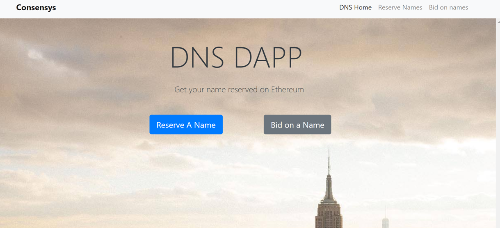
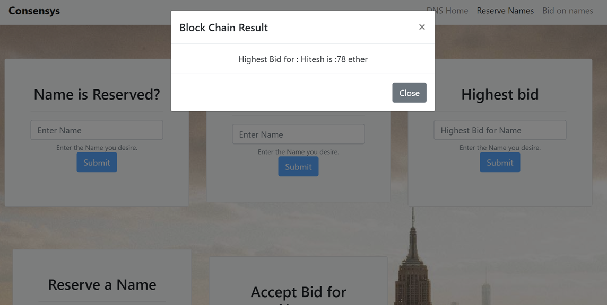

# dns-registry-dapp

## Git repo for decentralized DNS on top of Ethereum 


###  written by Hitesh Joshi - sendmailtojoshi@gmail.com

### What you can you do with the DNS DAapp

- Reserve a name with as low as 0.1 ether 
- Get the name's price
- Bid on a name
- Find the current owner's address
- Withdraw your bid - if you are outbidden
- As a owner accept bids and transfer name ownership
- Send money using names  

### Tech details
- Project is developed using Angular 4.
- Integrated with HD wallet - metamask for signing transactions to the network
- Metamask is the web3 provider.
- I have used a private geth node running at http://localhost:8545/
- Project uses truffle for compiling deploying contracts and uses promisified truffle api for interaction with contracts
- solidity and js tests are in test folder 

### Build Steps
From the root folder - contract
- Download the source
- npm install
- truffle compile
- truffle migrate *
- truffle test [Optional step]
- ng build --prod
- ng serve

* Note of truffle migrate
Since this step deploys the contract to the blockchain. If you are using a private or actual Ethereum blockchain, please make sure that the account you have used in truffle.js is unlocked.
I have used my coinbase in truffle.js, so here goes the command.

```
web3.personal.unlockAccount(eth.coinbase)
```

### Metamask is a dependency for the project

In order to run geth with metamask, please use the flag
--rpccorsdomain="chrome-extension://nkbihfbeogaeaoehlefnkodbefgpgknn 

```
geth --identity "nodeA" --rpccorsdomain "*" --datadir=".\geth_data" -verbosity 6 --port 54259  --rpc --rpcapi "eth,net,web3" --rpcaddr "127.0.0.1" --rpcport 8545 --fast --networkid 15 --nodiscover --mine --minerthreads 1 --rpccorsdomain="chrome-extension://nkbihfbeogaeaoehlefnkodbefgpgknn 
```

Note - I tried running the project with Ganache. At this point Ganache and metamask integration has some problem so I used my locally running node instead

https://github.com/MetaMask/metamask-extension/issues/2941
https://github.com/MetaMask/metamask-extension/issues/1999

Screenshots





