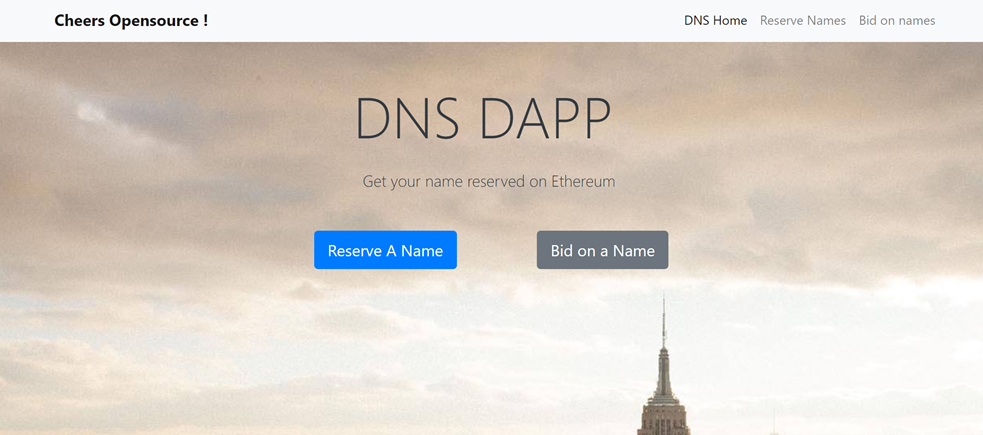
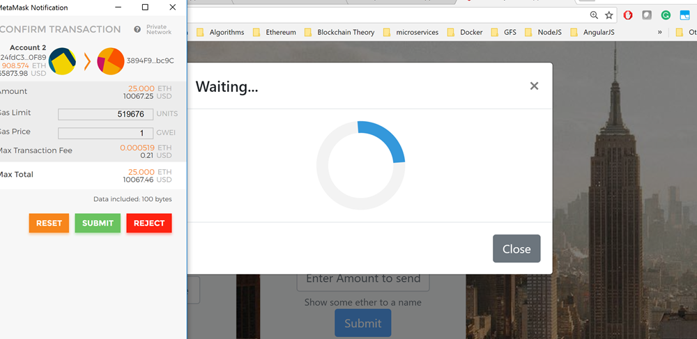
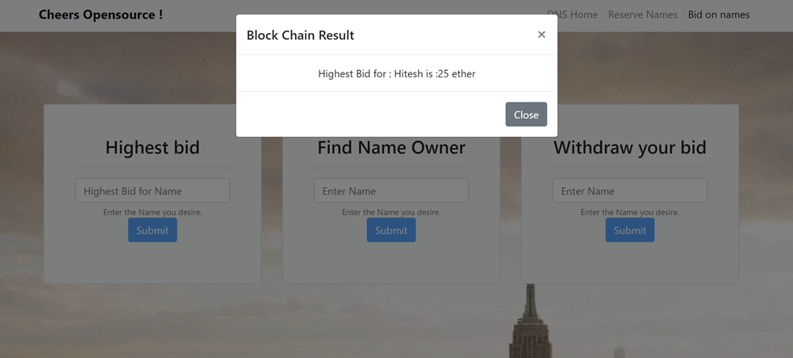

# dns-registry-dapp

# Git repo for decentralized DNS on top of Ethereum

### written by Hitesh Joshi - sendmailtojoshi@gmail.com

## Thanks to the good people of Heroku, the app is live at

https://fierce-plains-84557.herokuapp.com/dashboard

The heroku deployment has metamask incompatability and I am too busy to deploy it again. That said the code is fixed and will run nicely in local.

### What you can you do with the DNS DAapp

- Reserve a name with as low as 0.1 ether
- Get the name's price
- Bid on a name
- Find the current owner's address
- Withdraw your bid - if you are outbidden
- As a owner accept bids and transfer name ownership
- Send money using names

### Tech details
- Project is developed using Angular 4.
- Integrated with HD wallet - metamask for signing transactions to the network
- Metamask is the web3 provider.
- I have used a private geth node running at http://localhost:8545/
- Project uses truffle for compiling deploying contracts and uses promisified truffle api for interaction with contracts
- solidity and js tests are in test folder

### Build Steps

1. Clone the project
2. Ensure that you have angular cli installed globally
npm install -g @angular/cli
3. Ensure that you have ganache cli installed  globally (for development)
4. Start Ganache
ganache-cli --deterministic
5. npm install
6. Compile Contracts
 truffle compile
7. Deploy contracts
```
truffle migrate --network development
```
8. Run test suite - optional
```
truffle test
```
9.Build it 
```
ng build --prod
```
10.Run it
```
ng serve
```

11. Note - You  need to import the ganache accounts to your metamask.
Point your metamask to ganache and import using accounts private keys.

* Note of truffle migrate
  Since this step deploys the contract to the blockchain. If you are using a private or actual Ethereum blockchain, please make sure that the account you have used in truffle.js is unlocked.
 

### Mainnet or TestNet Deployment only ->
I have used my coinbase in truffle.js, so here goes the command.

```
web3.personal.unlockAccount(eth.coinbase)
```

### Metamask is a dependency for the project

In order to run geth with metamask, please use the flag
--rpccorsdomain="chrome-extension://nkbihfbeogaeaoehlefnkodbefgpgknn

```
geth --identity "nodeA" --rpccorsdomain "*" --datadir=".\geth_data" -verbosity 6 --port 54259  --rpc --rpcapi "eth,net,web3" --rpcaddr "127.0.0.1" --rpcport 8545 --fast --networkid 15 --nodiscover --mine --minerthreads 1 --rpccorsdomain="chrome-extension://nkbihfbeogaeaoehlefnkodbefgpgknn
```

Accompanying Blog
https://medium.com/@achiever.hitesh/own-your-identity-in-blockchain-747a91100b39

You can use Ganache or any test net.
Screenshots







